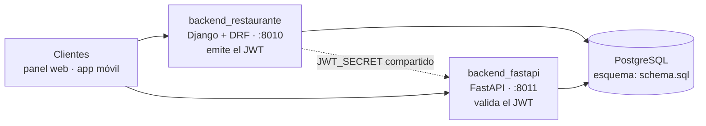
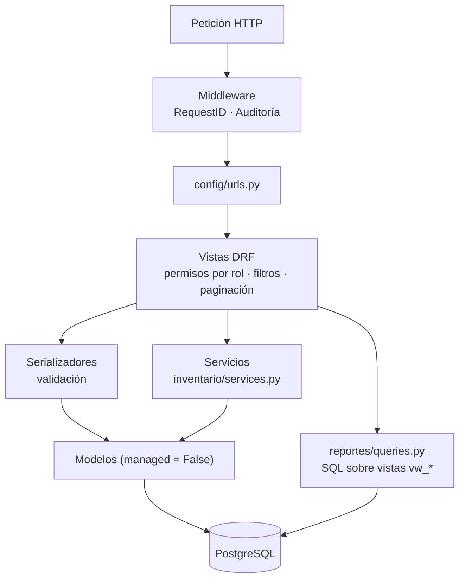
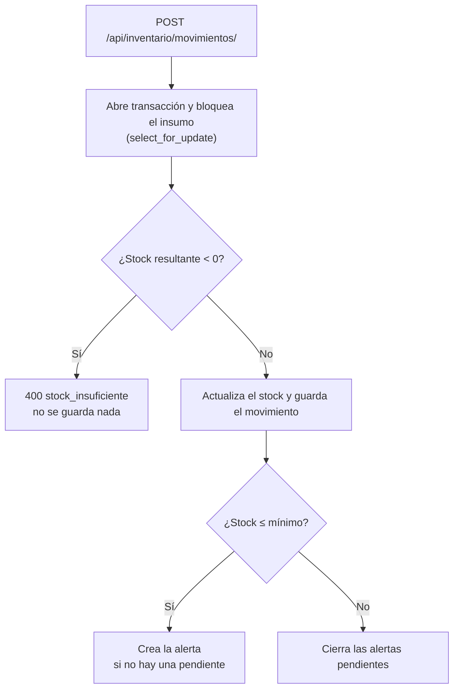
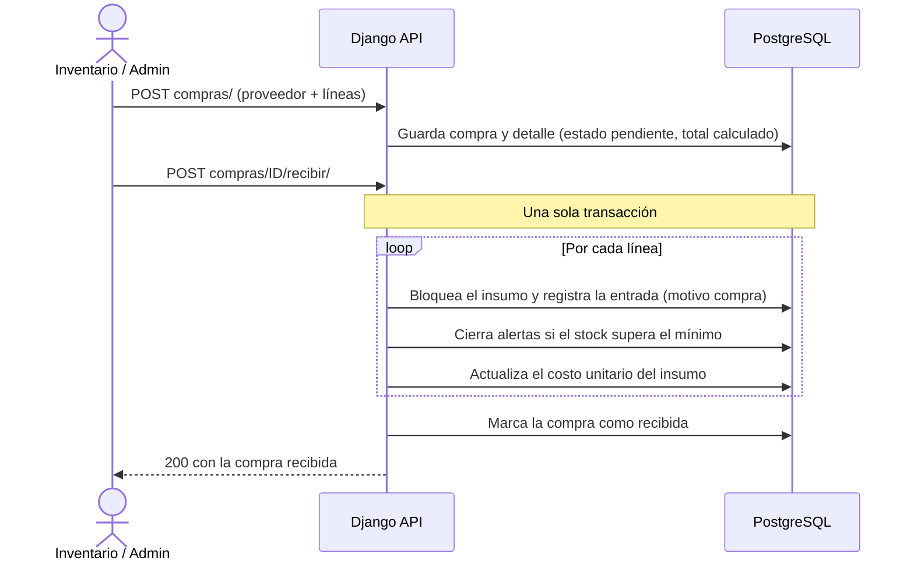

# Backend Administrativo · Sistema de Gestión para Restaurantes


API REST en Django que gestiona la parte administrativa de un restaurante: usuarios y roles, catálogo con recetas, inventario con alertas de stock, compras a proveedores, reportes y auditoría. Además emite el JWT que también valida el servicio de operación (`backend_fastapi`).

## Tabla de contenidos

- [Descripción](#descripción)
- [Características](#características)
- [Arquitectura](#arquitectura)
- [Stack tecnológico](#stack-tecnológico)
- [Requisitos previos](#requisitos-previos)
- [Instalación y ejecución](#instalación-y-ejecución)
- [Variables de entorno](#variables-de-entorno)
- [Uso](#uso)
- [API](#api)
- [Flujos principales](#flujos-principales)
- [Estructura del proyecto](#estructura-del-proyecto)
- [Pruebas](#pruebas)
- [Seguridad y consideraciones de producción](#seguridad-y-consideraciones-de-producción)
- [Limitaciones conocidas](#limitaciones-conocidas)
- [Autor y licencia](#autor-y-licencia)

## Descripción

En un restaurante, la carta, las recetas y el stock de insumos tienen que mantenerse alineados: cada plato consume insumos, cada insumo tiene un mínimo de reposición y cada reposición cambia el costo. Este backend concentra esa gestión y define quién puede hacer qué:

- El **administrador** y el **encargado de inventario** mantienen la carta, las recetas, los proveedores y las compras.
- Cada movimiento de stock queda registrado, no permite saldos negativos y dispara alertas cuando el insumo baja de su mínimo.
- Los **reportes** (ventas, productos más vendidos, consumo de insumos, stock bajo) se leen directamente de vistas SQL del esquema compartido.
- Toda escritura autenticada en la API queda en un registro de **auditoría**.

Es una de las piezas de un sistema mayor (ver [Arquitectura](#arquitectura)); no atiende mesas ni pedidos, que corresponden a `backend_fastapi`.

## Características

| Área | Qué incluye |
|---|---|
| **Autenticación** | Login por correo y contraseña, refresh y verificación de token, perfil y cambio de contraseña. El JWT incluye `rol`, `nombre` y `email`. |
| **Roles (RBAC)** | Cuatro roles: `admin`, `mesero`, `cocina` e `inventario`. Permisos declarativos por recurso y método HTTP. |
| **Usuarios** | CRUD solo para `admin`. `DELETE` es una baja lógica y `POST {id}/activar/` reactiva la cuenta. |
| **Catálogo** | Categorías, productos, insumos y recetas (cuánto insumo consume cada producto). |
| **Inventario** | Movimientos de entrada, salida y ajuste con bloqueo de fila y validación de stock no negativo. Alertas de stock bajo automáticas, sin duplicados, que se cierran solas al reponer. |
| **Proveedores y compras** | Órdenes de compra con líneas y total calculado. Al recibirlas se repone el stock y se actualiza el costo unitario; solo se pueden recibir una vez. |
| **Reportes** | Siete consultas de solo lectura sobre las vistas `vw_*` y tablas del esquema. |
| **Auditoría** | Middleware que registra las escrituras exitosas y autenticadas (`POST`, `PUT`, `PATCH`, `DELETE`) en `logs_auditoria`: usuario, acción, entidad, id y detalle (ruta, método, estado y `request_id`). Consulta restringida a `admin`. |
| **Trazabilidad** | Cabecera `X-Request-ID` en las respuestas (se reutiliza la del cliente si la envía). |
| **API consistente** | Paginación, filtros, búsqueda y ordenamiento estándar; errores con formato uniforme. |
| **Operación** | Endpoint `/health/`, Django Admin, comandos de datos demo (`seed_demo`, `reset_demo`), `Dockerfile` y logs JSON en producción. |

## Arquitectura

### Contexto

Este repositorio forma parte de un monorepo. Según el [README raíz](../README.md):

| Componente | Stack | Puerto | Responsabilidad |
|---|---|---|---|
| **`backend_restaurante`** (este) | Django 5 + DRF | 8010 | Usuarios y roles, catálogo, recetas, inventario, proveedores, compras, reportes, auditoría |
| [`backend_fastapi`](../backend_fastapi) | FastAPI + SQLAlchemy async | 8011 | Mesas, pedidos, tablero de cocina, WebSocket, pagos |
| [`frontend_restaurante`](../frontend_restaurante) | React + TypeScript + Vite | 5174 | Panel del administrador |
| [`frontend_movil_restaurante`](../frontend_movil_restaurante) | Flutter | — | App de meseros y cocina |



- **Autenticación única.** Django emite el token (HS256) con el `rol` en el payload. `backend_fastapi` no tiene login: valida el mismo token con el mismo `JWT_SECRET`. Si los secretos no coinciden, el login funciona pero FastAPI responde 401.
- **Base de datos compartida.** Las tablas operativas (`mesas`, `pedidos`, `detalle_pedido`, `pagos`) las escribe FastAPI. Usuarios, catálogo y proveedores los escribe este backend. `insumos`, `movimientos_inventario` y `alertas_inventario` las escriben ambos, siempre dentro de una transacción con bloqueo de fila.

### Diseño de este backend

Aplicación Django dividida por dominio, con lógica de negocio en servicios y SQL directo solo para reportes:



### Decisiones técnicas

| Decisión | Detalle | Dónde |
|---|---|---|
| **El esquema SQL es la fuente de verdad** | Todos los modelos de negocio son `managed = False` y apuntan a las tablas con `db_table`. Las migraciones de Django solo crean las tablas `django_*`; la migración inicial aplica `schema.sql` si la tabla `usuarios` aún no existe, de modo que `migrate` levanta una base vacía y las pruebas obtienen su esquema solas. | `apps/usuarios/migrations/0001_initial.py` |
| **Usuario propio sobre una tabla existente** | `Usuario` extiende `AbstractBaseUser` (sin `last_login` ni tablas de permisos de Django). `is_staff`, `is_superuser` y `has_perm` se resuelven a partir del campo `rol`. | `apps/usuarios/models.py` |
| **El stock solo cambia por movimientos** | `stock_actual` es de solo lectura en el API de catálogo y en el admin (salvo la carga inicial de `seed_demo`). Todo cambio pasa por `registrar_movimiento`: transacción, `select_for_update`, validación de saldo no negativo, registro del movimiento y evaluación de alerta. | `apps/inventario/services.py` |
| **Alertas idempotentes** | Si ya hay una alerta sin atender para el insumo no se crea otra; se cierran solas cuando el stock supera el mínimo. También se reevalúan al guardar un insumo (señal `post_save`). | `apps/inventario/services.py`, `signals.py` |
| **Bajas lógicas** | `DELETE` sobre usuarios, productos, insumos y proveedores marca `activo = false` en lugar de borrar la fila. | `views.py` de cada app |
| **Reportes sobre vistas SQL** | Consultas parametrizadas sobre las vistas `vw_*` de `schema.sql`, sin pasar por el ORM. | `apps/reportes/queries.py` |
| **Permisos declarativos por rol** | Una clase base resuelve el permiso según el rol y el método HTTP; `admin` siempre pasa. Cada recurso solo declara `roles_lectura` y `roles_escritura`. | `core/permissions.py` |
| **Contrato de errores uniforme** | Las reglas de negocio lanzan `ReglaNegocioError` (respuesta 400 con `code`) y las violaciones de integridad devuelven 409. | `core/exceptions.py` |
| **Configuración por entorno** | `config.settings.dev` (por defecto en `manage.py`) y `config.settings.prod` (por defecto en `wsgi.py` y `asgi.py`), con variables leídas por `python-decouple`. | `config/settings/` |

## Stack tecnológico

| Tecnología | Versión | Uso |
|---|---|---|
| Python | 3.10+ (imagen Docker: 3.12) | Lenguaje |
| Django | 5.1.6 | Framework web, ORM, Django Admin |
| Django REST Framework | 3.15.2 | API REST |
| djangorestframework-simplejwt | 5.4.0 | Emisión y verificación de JWT |
| django-filter | 24.3 | Filtros en los listados |
| django-cors-headers | 4.6.0 | CORS |
| psycopg (binary) | 3.2.4 | Driver de PostgreSQL |
| python-decouple | 3.8 | Configuración desde variables de entorno / `.env` |
| python-json-logger | 3.2.1 | Logs en JSON (producción) |
| Gunicorn | 23.0.0 | Servidor WSGI en Docker |
| PostgreSQL | 15+ (Compose: 16) | Base de datos |
| Docker / Docker Compose | — | Contenedores (el `docker-compose.yml` está en la raíz del monorepo) |

## Requisitos previos

- **Python 3.10 o superior** (verificado con 3.10.0).
- **PostgreSQL 15 o superior**, con un usuario que pueda crear bases de datos (Django crea una base `test_*` al ejecutar las pruebas).
- **`schema.sql` un nivel por encima de esta carpeta** (`../schema.sql`). La migración inicial y el `Dockerfile` lo necesitan, así que este directorio no funciona aislado del monorepo.
- Opcional: **Docker** y **Docker Compose** para la ruta con contenedores.

## Instalación y ejecución

### Opción A · Docker Compose (desde la raíz del monorepo)

```bash
docker compose up --build
```

Levanta PostgreSQL, ambos backends y el panel web. El servicio `backend_restaurante` ejecuta `migrate`, `seed_demo` y `gunicorn` al arrancar. Para levantar solo este backend y su base de datos:

```bash
docker compose up --build db backend_restaurante
```

Puertos publicados: `5432` (PostgreSQL), `8010` (este backend), `8011` (FastAPI) y `5174` (panel web); deben estar libres. `docker compose down` detiene los servicios y conserva los datos; `docker compose down -v` borra además el volumen de la base.

### Opción B · Entorno local

**1. Crear la base de datos.** No hace falta ejecutar `schema.sql` a mano: la primera migración lo aplica.

```bash
psql -U postgres -c "CREATE DATABASE restaurante ENCODING 'UTF8';"
```

**2. Entorno virtual y dependencias** (desde `backend_restaurante/`):

```bash
# Linux / macOS
python -m venv .venv
source .venv/bin/activate
pip install -r requirements.txt
cp .env.example .env
```

```powershell
# Windows (PowerShell)
python -m venv .venv
.venv\Scripts\Activate.ps1
pip install -r requirements.txt
Copy-Item .env.example .env
```

**3. Configurar `.env`.** Ajusta al menos `DB_PASSWORD` y define `SECRET_KEY` y `JWT_SECRET` propios (ver [Variables de entorno](#variables-de-entorno)).

**4. Migrar, cargar datos demo y arrancar:**

```bash
python manage.py migrate
python manage.py seed_demo
python manage.py runserver 8010
```

**5. Comprobar que responde:**

```bash
curl http://localhost:8010/health/
# {"status": "ok", "service": "backend_restaurante"}
```

Django Admin: <http://localhost:8010/admin/>. Inicia sesión con el correo de un usuario de rol `admin`.

## Variables de entorno

Se leen desde el entorno o desde un archivo `.env` (no versionado; el ejemplo es `.env.example`).

| Variable | Descripción | Valor por defecto |
|---|---|---|
| `SECRET_KEY` | Clave secreta de Django. **Obligatoria en producción.** | valor inseguro de desarrollo |
| `JWT_SECRET` | Clave de firma del JWT. **Debe ser idéntica a la de `backend_fastapi`.** | valor inseguro de desarrollo |
| `JWT_ALGORITHM` | Algoritmo de firma. | `HS256` |
| `JWT_ACCESS_MINUTES` | Vigencia del access token, en minutos. | `60` |
| `JWT_REFRESH_DAYS` | Vigencia del refresh token, en días. | `7` |
| `DEBUG` | Modo depuración. | `False` (`.env.example` lo pone en `True`) |
| `ALLOWED_HOSTS` | Hosts permitidos, separados por comas. | `localhost,127.0.0.1` |
| `TIME_ZONE` | Zona horaria. | `America/Lima` |
| `DB_NAME` | Nombre de la base de datos. | `restaurante` |
| `DB_USER` | Usuario de PostgreSQL. | `postgres` |
| `DB_PASSWORD` | Contraseña de PostgreSQL. | — (definir) |
| `DB_HOST` | Host de PostgreSQL. | `localhost` |
| `DB_PORT` | Puerto de PostgreSQL. | `5432` |
| `CORS_ALLOWED_ORIGINS` | Orígenes permitidos, separados por comas. | `http://localhost:5173,http://127.0.0.1:5173` |
| `DJANGO_SETTINGS_MODULE` | Módulo de configuración. | `config.settings.dev` con `manage.py`; `config.settings.prod` con `wsgi`/`asgi` |

Ejemplo de `.env` con marcadores (sustituye los valores):

```env
SECRET_KEY=<clave-larga-y-aleatoria>
JWT_SECRET=<mismo-valor-que-en-backend_fastapi>
DEBUG=True
DB_NAME=<nombre_de_tu_base_de_datos>
DB_USER=postgres
DB_PASSWORD=<tu-contraseña>
DB_HOST=localhost
DB_PORT=5432
```

Para generar valores aleatorios:

```bash
python -c "from django.core.management.utils import get_random_secret_key; print(get_random_secret_key())"
python -c "import secrets; print(secrets.token_urlsafe(48))"
```

> **CORS.** Con `config.settings.dev` se aceptan todos los orígenes y esta variable no aplica. Con `config.settings.prod` sí se respeta: `.env.example` ya incluye el puerto `5174`, donde corre `frontend_restaurante` en este monorepo.

## Uso

### Cuentas de demostración

`seed_demo` crea cuatro cuentas, una por rol. Las contraseñas están definidas en [`seed_demo.py`](apps/usuarios/management/commands/seed_demo.py) y son solo para datos de demostración.

| Rol | Correo |
|---|---|
| Administrador | `admin@restaurante.com` |
| Inventario | `inventario@restaurante.com` |
| Mesero | `mesero@restaurante.com` |
| Cocina | `cocina@restaurante.com` |

### Comandos propios

| Comando | Qué hace |
|---|---|
| `python manage.py seed_demo [--mesas 12]` | Carga las 4 cuentas, mesas (12 por defecto), 4 categorías, 15 insumos, 11 productos con receta y 3 proveedores. Es idempotente: no duplica datos, y al repetirlo restablece nombre, rol, contraseña y estado activo de las cuentas demo y la capacidad de las mesas. |
| `python manage.py reset_demo` | **Destructivo, sin confirmación.** Vacía con `TRUNCATE` pagos, pedidos y su detalle, compras y su detalle, movimientos, alertas y logs de auditoría, y libera todas las mesas. Conserva catálogo, insumos, proveedores y usuarios. |
| `python manage.py reset_demo --todo` | Además vacía recetas, productos, categorías, insumos, proveedores y mesas. No elimina usuarios. |

### Ejemplo rápido

```bash
# 1. Login: devuelve access, refresh y los datos del usuario
curl -s -X POST http://localhost:8010/api/auth/login/ \
  -H "Content-Type: application/json" \
  -d '{"email": "<CORREO>", "password": "<CONTRASEÑA>"}'

# 2. Consultar un endpoint protegido con el access token
curl -s http://localhost:8010/api/reportes/resumen/ \
  -H "Authorization: Bearer <ACCESS_TOKEN>"

# 3. Registrar una salida de inventario
curl -s -X POST http://localhost:8010/api/inventario/movimientos/ \
  -H "Authorization: Bearer <ACCESS_TOKEN>" \
  -H "Content-Type: application/json" \
  -d '{"insumo": 1, "tipo": "salida", "motivo": "merma", "cantidad": "2.000"}'
```

En PowerShell usa `curl.exe` en lugar de `curl`.

## API

Base URL local: `http://localhost:8010`. Las rutas bajo `/api/`, salvo `login`, `refresh` y `verify`, exigen la cabecera `Authorization: Bearer <access_token>`.

### Convenciones

- **Paginación** en los listados de `ViewSet`: `?page=` y `?page_size=` (25 por defecto, máximo 200). Respuesta: `{"count", "page", "pages", "page_size", "results"}`. Los reportes, `alertas/pendientes/` y `productos/{id}/receta/` devuelven una lista simple.
- **Filtros, búsqueda y orden** según el recurso: `?<campo>=`, `?search=` y `?ordering=`.
- **Errores** con formato uniforme:

```json
{"detail": "Stock insuficiente de 'Azucar': disponible 12.000, solicitado 99.000.", "code": "stock_insuficiente"}
```

Los errores de validación devuelven `{"detail": "Datos invalidos.", "code": "validacion", "errors": {...}}`, y las violaciones de integridad, `409` con `code: "integridad"`.

### Endpoints

`CRUD` significa `GET` y `POST` sobre la colección, y `GET`, `PUT`, `PATCH` y `DELETE` sobre `{id}/`.

**Autenticación** · `/api/auth/`

| Método | Ruta | Descripción |
|---|---|---|
| `POST` | `login/` | Login con `email` y `password`. Devuelve `access`, `refresh` y `usuario`. Público. |
| `POST` | `refresh/` | Renueva el access token. Público. |
| `POST` | `verify/` | Verifica un token. Público. |
| `GET` | `perfil/` | Datos del usuario autenticado. |
| `POST` | `password/` | Cambia la contraseña (`password_actual`, `password_nueva`). |

**Usuarios** · `/api/usuarios/` · solo `admin`

| Método | Ruta | Descripción |
|---|---|---|
| `GET` `POST` | `/` | Listar / crear. Filtros: `rol`, `activo`. Búsqueda: `nombre`, `email`. |
| `GET` `PUT` `PATCH` `DELETE` | `{id}/` | Detalle / editar / baja lógica. |
| `POST` | `{id}/activar/` | Reactiva un usuario dado de baja. |

**Catálogo** · `/api/catalogo/`

| Método | Ruta | Descripción |
|---|---|---|
| `CRUD` | `categorias/` | Categorías. |
| `GET` `POST` | `productos/` | Productos. Filtros: `categoria`, `activo`. Búsqueda: `nombre`, `descripcion`. |
| `GET` `PUT` `PATCH` `DELETE` | `productos/{id}/` | Detalle con su receta. `DELETE` es baja lógica. |
| `GET` `POST` | `productos/{id}/receta/` | Consultar / agregar una línea de receta. |
| `CRUD` | `insumos/` | Insumos. `stock_actual` es de solo lectura; `DELETE` es baja lógica. |
| `CRUD` | `recetas/` | Líneas de receta. Filtros: `producto`, `insumo`. |

**Inventario** · `/api/inventario/`

| Método | Ruta | Descripción |
|---|---|---|
| `GET` | `movimientos/` · `{id}/` | Historial. Filtros: `insumo`, `tipo`, `motivo`. |
| `POST` | `movimientos/` | Registra un movimiento: `insumo`, `tipo` (`entrada`/`salida`/`ajuste`), `motivo` (`venta`/`compra`/`ajuste_manual`/`merma`), y `cantidad` (entrada/salida) o `stock_objetivo` (ajuste). |
| `GET` | `alertas/` · `{id}/` | Alertas de stock. Filtros: `atendida`, `insumo`. |
| `GET` | `alertas/pendientes/` | Alertas sin atender. |
| `POST` | `alertas/{id}/atender/` | Marca una alerta como atendida. |

**Proveedores y compras** · `/api/proveedores/`

| Método | Ruta | Descripción |
|---|---|---|
| `CRUD` | `proveedores/` | Proveedores. `DELETE` es baja lógica. |
| `GET` `POST` | `compras/` | Listar / crear (`proveedor` y `detalles`: `insumo`, `cantidad`, `precio_unitario`). Filtros: `estado`, `proveedor`. |
| `GET` | `compras/{id}/` | Detalle. Las compras no admiten `PUT`, `PATCH` ni `DELETE` (`405`). |
| `POST` | `compras/{id}/recibir/` | Recibe la compra: entrada de stock por línea y actualización del costo. Solo una vez; si no, `400`. |
| `POST` | `compras/{id}/cancelar/` | Cancela una compra pendiente. |

**Reportes** · `/api/reportes/` · solo lectura

| Ruta | Parámetros | Descripción |
|---|---|---|
| `resumen/` | — | Ventas y pedidos de hoy, pedidos activos, mesas ocupadas, alertas y productos activos. |
| `ventas-diarias/` | `dias` (30, máx. 365) | Ventas por día. |
| `productos-mas-vendidos/` | `limite` (10, máx. 100) | Unidades e ingresos por producto. |
| `insumos-stock-bajo/` | — | Insumos en o bajo su mínimo. |
| `consumo-insumos/` | `limite` (10, máx. 100) | Consumo total por insumo. |
| `ventas-por-categoria/` | `dias` (30, máx. 365) | Ingresos y unidades por categoría. |
| `pedidos/` | `limite` (25, máx. 200), `offset`, `estado` | Historial de pedidos. |

**Auditoría** · `/api/auditoria/` · solo `admin`

| Método | Ruta | Descripción |
|---|---|---|
| `GET` | `logs/` · `logs/{id}/` | Registros de auditoría. Filtros: `accion`, `entidad`, `usuario`. Búsqueda: `entidad`, `entidad_id`. |

**Sistema**

| Método | Ruta | Descripción |
|---|---|---|
| `GET` | `/health/` | Estado del servicio. Público. |
| — | `/admin/` | Django Admin (usuarios con rol `admin`). |

### Permisos por rol

`admin` siempre tiene acceso completo. Para el resto, el permiso depende del método HTTP (lectura = `GET`, `HEAD`, `OPTIONS`):

| Recurso | `mesero` | `cocina` | `inventario` |
|---|---|---|---|
| Catálogo | lectura | lectura | lectura y escritura |
| Inventario (movimientos y alertas) | — | lectura | lectura y escritura |
| Proveedores y compras | — | — | lectura y escritura |
| Reportes | — | — | lectura |
| Usuarios y auditoría | — | — | — |

## Flujos principales

### Movimiento de stock

Todo cambio de stock pasa por `registrar_movimiento`. Un `ajuste` fija el stock al valor objetivo indicado; una `entrada` o `salida` suma o resta la cantidad.



### Compra a proveedor



Una compra que no está `pendiente` (ya recibida o cancelada) no puede volver a recibirse: responde `400` con `code: "estado_invalido"`.

### Del catálogo a la venta

Según el [README raíz](../README.md): el administrador define productos, insumos y recetas en este backend; el mesero toma pedidos vía `backend_fastapi`, que descuenta los insumos de cada receta en una sola transacción y registra los movimientos; los reportes de este backend leen esas ventas.

## Estructura del proyecto

```text
backend_restaurante/
├── manage.py
├── requirements.txt
├── Dockerfile
├── .env.example
├── config/
│   ├── settings/          # base.py · dev.py · prod.py
│   ├── urls.py            # rutas raíz y /health/
│   ├── wsgi.py
│   └── asgi.py
├── core/                  # piezas transversales
│   ├── permissions.py     # RolPermission y permisos por recurso
│   ├── exceptions.py      # ReglaNegocioError y manejador de errores
│   └── pagination.py
└── apps/
    ├── usuarios/          # usuario, login/JWT, roles, comandos seed_demo y reset_demo
    ├── productos/         # catálogo: categorías, productos, insumos, recetas  (/api/catalogo/)
    ├── inventario/        # movimientos, alertas, services.py, signals.py
    ├── proveedores/       # proveedores y compras
    ├── reportes/          # queries.py: SQL sobre vistas vw_*
    └── auditoria/         # modelo de logs y middleware
```

Cada app sigue la misma forma (`models`, `serializers`, `views`, `urls`, `admin`, `tests`). El esquema vive fuera de esta carpeta: `../schema.sql`.

## Pruebas

```bash
python manage.py test
```

Ejecuta 38 pruebas (verificadas: todas pasan). Necesitan PostgreSQL accesible con las credenciales de `.env`; Django crea y elimina una base `test_<DB_NAME>` y le aplica `schema.sql` mediante la migración inicial.

| Área | Archivo | Pruebas |
|---|---|---|
| Autenticación y roles | `apps/usuarios/tests/test_auth.py` | 9 |
| Catálogo y recetas | `apps/productos/tests/test_catalogo.py` | 8 |
| Movimientos y alertas de stock | `apps/inventario/tests/test_inventario.py` | 10 |
| Compras a proveedores | `apps/proveedores/tests/test_compras.py` | 6 |
| Reportes | `apps/reportes/tests/test_reportes.py` | 5 |

## Seguridad y consideraciones de producción

**Implementado**

- Contraseñas almacenadas con hash (nunca en texto plano) y validadas con los validadores de contraseña de Django al crear usuarios o cambiarlas.
- JWT con vigencia configurable y autorización por rol en cada recurso.
- CORS restringido a una lista de orígenes (`config.settings.prod`).
- `config.settings.prod`: `DEBUG = False`, cookies de sesión y CSRF solo por HTTPS, HSTS de un año, `nosniff`, `X-Frame-Options: DENY` y logs en JSON.
- Registro de auditoría de las escrituras autenticadas.

**A tener en cuenta**

- `SECRET_KEY` y `JWT_SECRET` tienen un valor por defecto conocido. Si no se definen, la aplicación arranca igualmente con ese valor, incluso con `config.settings.prod`: defínelos siempre fuera de desarrollo.
- El servicio de Compose ejecuta `seed_demo` en cada arranque. Eso crea (o restablece) las cuentas demo con contraseñas conocidas: no publiques ese despliegue tal cual.
- `reset_demo` trunca tablas sin pedir confirmación; no lo ejecutes contra datos que quieras conservar.

## Limitaciones conocidas

- **No funciona aislado del monorepo:** necesita `../schema.sql` (migración inicial y `Dockerfile`).
- **Sin documentación OpenAPI/Swagger:** esta sección de API es la referencia.
- **Sin CI** y sin pruebas dedicadas para la auditoría, los comandos de demo ni el cambio de contraseña.
- **Docker y archivos estáticos:** la imagen no ejecuta `collectstatic` ni incluye un servidor de estáticos, por lo que los estáticos de Django Admin no se sirven con `DEBUG = False`.

<!-- TODO: añadir capturas o enlace a una demo desplegada (por ejemplo, Django Admin o respuestas de la API) cuando estén disponibles. -->

## Autor y licencia

<!-- TODO: añadir nombre del autor y enlaces de contacto (GitHub, LinkedIn). -->

Proyecto de portafolio. Aún no se ha definido una licencia (no hay archivo `LICENSE` en el repositorio).
